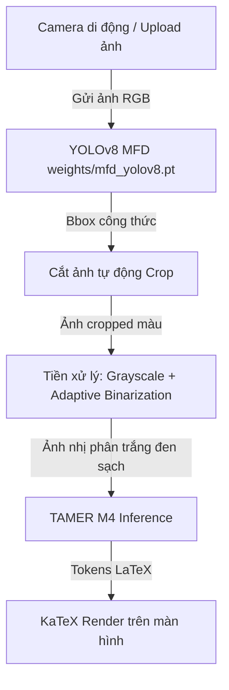

# HMER Mobile-Friendly Web Application: PDF-Extract-Kit MFD + TAMER M4

Ứng dụng này cung cấp giao diện Web di động cho nhận dạng biểu thức toán học viết tay (Handwritten Mathematical Expression Recognition - HMER) thông qua camera điện thoại di động hoặc ảnh tải lên.

## 🌟 Tính năng nổi bật
1. **Chụp ảnh trực tiếp từ Camera (`st.camera_input`):** Tối ưu hóa giao diện di động để chụp nhanh công thức viết tay từ giấy.
2. **Tự động quét & cắt vùng công thức (Auto-Formula Crop):** Sử dụng mô hình **YOLOv8 MFD** (Mathematical Formula Detection) của PDF-Extract-Kit để tự động phát hiện và khoanh vùng các công thức trong ảnh, hạn chế tối đa nhiễu nền xung quanh.
3. **Tiền xử lý nâng cao (Domain Adaptation Preprocessing):** Chuẩn hóa ảnh cắt (Deskew, Adaptive Binarization, Denoise) để chuyển đổi ảnh chụp từ camera thực tế thành dạng ảnh tương thích 100% với dữ liệu huấn luyện của mô hình.
4. **Nhận dạng hình học GAT (TAMER M4):** Sử dụng mô hình cải tiến tối ưu nhất **Coordinate-Aware GAT 1L/4H** để xuất ra chuỗi mã LaTeX có độ chính xác cấu trúc cao nhất.
5. **Xem trước trực quan:** Render công thức toán học trực tiếp trên màn hình di động bằng KaTeX.

---

## 📂 Cấu trúc thư mục

```markdown
app_hmer/
├── weights/
│   └── mfd_yolov8.pt       # Bắt buộc: Tải về từ OpenDataLab (xem hướng dẫn bên dưới)
├── utils/
│   ├── __init__.py
│   ├── image_processing.py # Chứa các hàm tiền xử lý (Deskew, Binarize, Padding)
│   └── inference.py        # Hàm nạp và chạy model YOLOv8 MFD & TAMER M4
├── app.py                  # Mã nguồn giao diện chính (Streamlit Web App)
├── requirements.txt        # Các gói thư viện cần cài đặt
└── README.md               # Đặc tả chi tiết dự án (Tài liệu này)
```

---

## 🛠️ Hướng dẫn cài đặt & Thiết lập

### Bước 1: Chuẩn bị môi trường Python
Ứng dụng sử dụng chung môi trường `TAMER` (chạy trên GPU RTX 3070 hoặc CPU).

```bash
# Kích hoạt môi trường conda
conda activate TAMER

# Di chuyển vào thư mục app
cd app_hmer

# Cài đặt các thư viện cần thiết
pip install -r requirements.txt
```

### Bước 2: Tải file Weights của YOLOv8 MFD
Bạn cần tải tệp weights của mô hình phát hiện công thức từ OpenDataLab về đặt trong thư mục `weights/`:

```bash
mkdir -p weights

# Tải từ ModelScope (Khuyên dùng - tốc độ nhanh tại VN)
wget -c https://www.modelscope.cn/models/wanderkid/PDF-Extract-Kit/resolve/master/models/MFD/weights.pt -O weights/mfd_yolov8.pt

# Hoặc tải từ Hugging Face
wget -c https://huggingface.co/wanderkid/PDF-Extract-Kit/resolve/main/models/MFD/weights.pt -O weights/mfd_yolov8.pt
```

### Bước 3: Thiết lập checkpoint mô hình TAMER M4
Đảm bảo checkpoint tốt nhất của bạn đã nằm ở thư mục kết quả:
`chuyende_tamer_temp/KetQua/4_Coord_Aware_GAT_1L_4H/checkpoints/best_model.ckpt`

---

## 🚀 Cách chạy ứng dụng

Chạy lệnh Streamlit tại thư mục gốc của repository:

```bash
streamlit run app_hmer/app.py --server.port 8501 --server.address 0.0.0.0
```

* **Truy cập nội bộ:** Mở trình duyệt máy tính truy cập `http://localhost:8501`.
* **Truy cập từ điện thoại di động:** Đảm bảo điện thoại kết nối cùng mạng Wi-Fi với máy chủ RTX 3070. Truy cập vào địa chỉ IP nội bộ của máy chủ (ví dụ: `http://192.168.1.XX:8501`).

---

## 🧠 Đặc tả luồng xử lý dữ liệu (Data Pipeline)



### Chi tiết các khối xử lý:
1. **Khối Phát hiện (MFD Block):**
   Mô hình YOLOv8 quét ảnh với kích thước ảnh `imgsz=1280`, `conf=0.25` và `iou=0.45` để lấy danh sách tọa độ `[x_min, y_min, x_max, y_max]`.
2. **Khối Tiền xử lý (Pre-processing Block):**
   * *Binarize:* Chuyển đổi sang ảnh nhị phân để loại bỏ độ mờ bóng tối camera.
   * *Padding & Resizing:* Đệm viền trắng xung quanh công thức để mô phỏng chính xác khung ảnh số hóa của tập dữ liệu CROHME, tránh biến dạng tỷ lệ nét vẽ.
3. **Khối Nhận dạng (M4 Block):**
   Đưa ảnh nhị phân đã chuẩn hóa kích thước vào mạng TAMER. Khối DenseNet + Coordinate-Aware GAT 1L/4H sẽ xử lý và truyền mã đặc trưng không gian trực tiếp tới Transformer Decoder để dịch ra chuỗi biểu thức LaTeX hoàn chỉnh.
