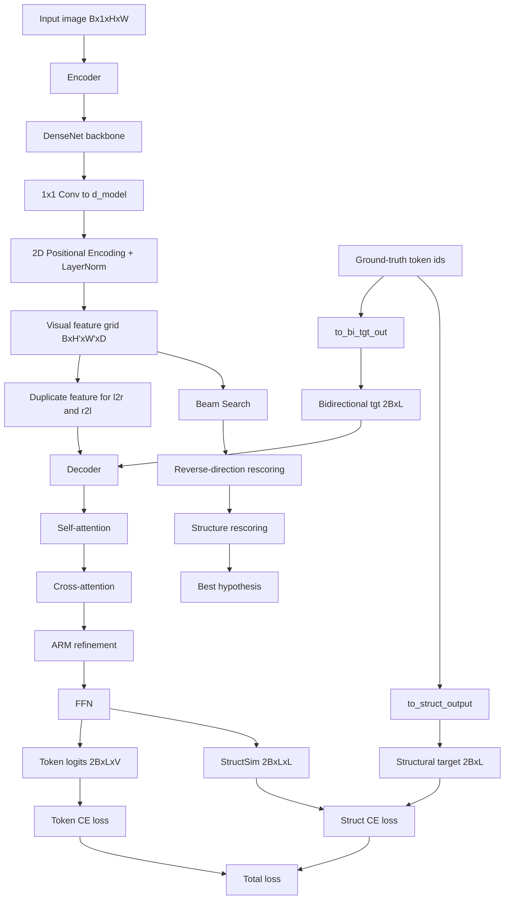
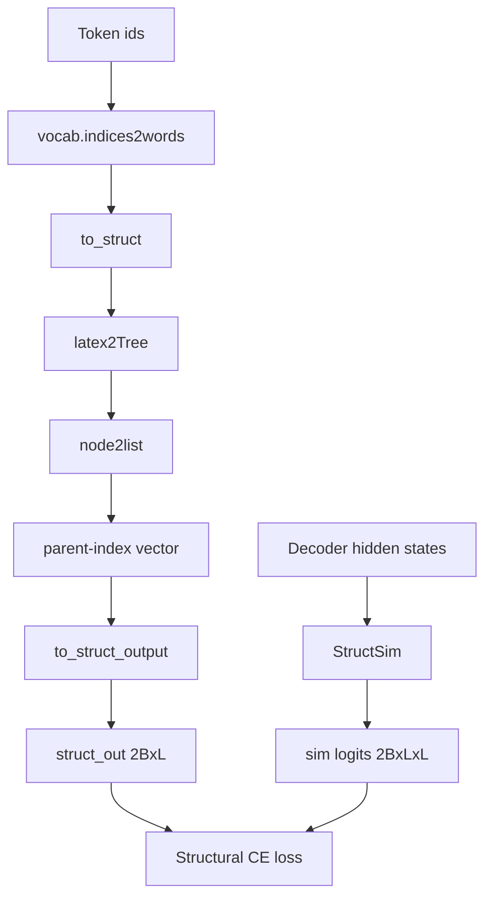

# Context: `baseline/`

## 1. Mục đích tổng thể

Thư mục `baseline/` chứa một baseline hoàn chỉnh cho bài toán HMER dựa trên dự án **TAMER: Tree-Aware Transformer for Handwritten Mathematical Expression Recognition**. Đây là một codebase tương đối độc lập, gồm:

- mã huấn luyện bằng PyTorch Lightning,
- pipeline dữ liệu cho CROHME và HME100K,
- kiến trúc model encoder-decoder với cơ chế tree-aware / structure-aware,
- script đánh giá,
- một số checkpoint và artifact suy luận đã lưu.

Baseline này được đóng gói như một Python package tên `tamer`.

## 2. Cấu trúc thư mục thực tế

Theo nội dung hiện có trong repo, `baseline/` gồm các phần chính:

- `baseline/README.md`: mô tả dự án TAMER, cách cài đặt, train/eval, bảng kết quả.
- `baseline/setup.py`: đóng gói package `tamer`.
- `baseline/requirements.txt`: dependency Python bổ sung.
- `baseline/train.py`: entrypoint train bằng Lightning CLI.
- `baseline/config/`: config train cho `crohme` và `hme100k`.
- `baseline/tamer/`: package mã nguồn chính.
- `baseline/eval/`: script test/eval.
- `baseline/images/Bracket_Matching_Accuracy.png`: hình minh họa trong README.
- `baseline/lightning_logs/`: chứa checkpoint/config/hparams/artifact đã lưu.

Các thư mục con thực tế hiện có trong `baseline/lightning_logs/` là:

- `version_0`
- `version_1`
- `version_3`

README còn nhắc tới `version_2`, nhưng thư mục đó hiện không có trong `baseline/`.

## 3. Tóm tắt từng file cấp cao

### 3.1 File gốc

#### `baseline/README.md`

README mô tả baseline là TAMER, trỏ tới bài báo arXiv, nêu:

- môi trường gợi ý: Python 3.7, PyTorch 1.8.1, Lightning 1.4.9,
- dữ liệu đặt trong `data/crohme` và `data/hme100k`,
- lệnh train:
  - `python -u train.py --config config/crohme.yaml`
  - `python -u train.py --config config/hme100k.yaml`
- lệnh eval:
  - `bash eval/eval_crohme.sh 0`
  - `bash eval/eval_hme100k.sh 1`

README cũng công bố kết quả định lượng cho CROHME và HME100K, nhấn mạnh lợi ích về bracket matching accuracy.

Điểm cần lưu ý:

- README nói weight cho CROHME và HME100K nằm ở `version_0` và `version_1`.
- Nhưng trong thư mục thực tế còn có thêm `version_3`, là checkpoint HME100K khác với cấu hình khác.

#### `baseline/setup.py`

File này:

- đặt tên package là `tamer`,
- version `0.0.1`,
- tác giả `Jianhua Zhu`,
- đọc dependency từ `requirements.txt`,
- dùng `find_packages()` để đóng gói toàn bộ package con.

#### `baseline/requirements.txt`

Dependency bổ sung gồm:

- `einops`, `editdistance`,
- `jsonargparse[signatures]` cho Lightning CLI,
- công cụ dev: `flake8`, `black`, `isort`, `jupyter`,
- xử lý ảnh/visualization: `opencv-python`, `matplotlib`,
- dependency eval CROHME: `typer`, `beautifulsoup4`, `lxml`.

#### `baseline/train.py`

Entry point cực gọn:

- import `LightningCLI`,
- ghép `LitTAMER` với `HMEDatamodule`,
- đặt `DDPPlugin(find_unused_parameters=False)`.

Tức là gần như toàn bộ logic train được cấu hình qua Lightning CLI + YAML.

## 4. Config huấn luyện

### `baseline/config/crohme.yaml`

Đặc điểm chính:

- seed `7`,
- train DDP trên GPU `0,1,2,3`,
- `max_epochs: 400`,
- validate mỗi `2` epoch,
- model:
  - `d_model: 256`
  - DenseNet growth rate `24`
  - `num_layers: 16`
  - decoder heads `8`
  - `num_decoder_layers: 3`
  - feedforward `1024`
  - ARM channel `dc: 32`
  - `dropout: 0.3`
  - `vocab_size: 113`
  - `cross_coverage: true`
  - `self_coverage: true`
  - beam search size `10`, `max_len: 200`
- optimizer side:
  - `learning_rate: 1.0`
  - `patience: 20`
  - milestones `[300, 350]`
- data:
  - `folder: data/crohme`
  - `test_folder: 2014`
  - `max_size: 320000`
  - `scale_to_limit: true`
  - train batch `8`, eval batch `2`.

### `baseline/config/hme100k.yaml`

Khung gần giống CROHME nhưng khác ở:

- `max_epochs: 70`,
- `vocab_size: 248`,
- `learning_rate: 5e-4`,
- `patience: 10`,
- milestones `[100, 120]`,
- data:
  - `folder: data/hme100k`
  - `test_folder: test`
  - `max_size: 480000`
  - `scale_to_limit: false`
  - eval batch `4`.

Lưu ý: `max_epochs` là `70`, nhưng checkpoint cũ trong `lightning_logs/version_1/config.yaml` lại ghi `max_epochs: 120`, nghĩa là artifact đã lưu không hoàn toàn đồng nhất với YAML đang đặt ở `baseline/config/`.

## 5. Package `tamer/`

### 5.1 Tổng quan

`baseline/tamer/` là package chính, chia thành:

- `datamodule/`: đọc dữ liệu, transform, vocab, chuyển LaTeX sang cấu trúc cây,
- `model/`: encoder, decoder, positional encoding, custom transformer,
- `utils/`: beam search, generation, loss/metric/helper,
- `lit_tamer.py`: LightningModule bọc toàn bộ train/val/test.

`baseline/tamer/__init__.py` và `baseline/tamer/model/__init__.py` hiện rỗng.

### 5.2 `lit_tamer.py`

Đây là trung tâm huấn luyện và đánh giá.

#### Vai trò chính

- khởi tạo `TAMER`,
- định nghĩa `training_step`, `validation_step`, `test_step`,
- cấu hình optimizer/scheduler,
- chạy beam search hai chiều khi validation/test.

#### Training

Ở `training_step`:

- chuyển target sang dạng bidirectional bằng `to_bi_tgt_out`,
- tạo structural supervision bằng `to_struct_output`,
- model trả về:
  - `out_hat`: logits token,
  - `sim`: ma trận similarity/cấu trúc,
- loss cuối cùng = `ce_loss(out_hat, out)` + `ce_loss(sim, struct_out, ignore_idx=-1)`.

Nghĩa là baseline học song song:

- dự đoán chuỗi token,
- dự đoán quan hệ cấu trúc giữa token.

#### Validation

Ở `validation_step`:

- vẫn tính `val_loss` và `val/struct_loss`,
- sau đó chạy `approximate_joint_search`,
- đo `val_ExpRate` bằng khớp chuỗi token dự đoán và ground truth.

#### Test

Ở `test_step` và `test_epoch_end`:

- chạy beam search,
- ghi `result.zip` với mỗi mẫu thành một file `.txt`,
- ghi `errors.json` cho mẫu sai,
- ghi `predictions.json` cho toàn bộ mẫu.

Distance dùng `editdistance`.

#### Optimizer

Đang dùng:

- `optim.Adadelta(lr=..., eps=1e-6, weight_decay=1e-4)`
- `MultiStepLR(gamma=0.1)`

`AdamW` và `ReduceLROnPlateau` có trong code nhưng đang comment.

## 6. Pipeline dữ liệu (`tamer/datamodule/`)

### `datamodule.py`

File này định nghĩa hầu hết pipeline dữ liệu.

#### Dữ liệu đầu vào mong đợi

Mỗi split trong `data/.../<split>/` cần có:

- `images.pkl`
- `caption.txt`

`images.pkl` chứa dictionary ảnh đã load sẵn.

`caption.txt` có format:

- token đầu là tên ảnh,
- phần còn lại là chuỗi token LaTeX đã tách sẵn.

#### `extract_data`

Đọc `images.pkl` + `caption.txt`, tạo list:

- `(img_name, img, formula_tokens)`.

#### `data_iterator`

Logic batching ở đây không phải batching bình thường theo từng sample, mà:

- sort mẫu theo diện tích ảnh,
- gom thành các “mega-batch” sao cho:
  - số lượng sample không vượt `batch_size`,
  - `biggest_image_size * current_batch_count <= max_size`.

Điều này giúp kiểm soát tổng chi phí bộ nhớ theo kích thước ảnh.

Với sample train:

- bỏ qua công thức dài hơn `maxlen`,
- bỏ qua ảnh có diện tích lớn hơn `max_size`.

#### `Batch` dataclass

Batch runtime gồm:

- `img_bases`
- `imgs` tensor `[b, 1, H, W]`
- `mask` tensor bool `[b, H, W]`
- `indices` là danh sách token id chưa pad.

#### `collate_fn`

Điểm quan trọng:

- `DataLoader` trả mỗi lần đúng 1 phần tử dataset,
- vì bản thân mỗi phần tử dataset đã là một batch được chuẩn bị sẵn,
- `collate_fn` assert `len(batch) == 1`.

Tức là dataset không biểu diễn sample-level theo nghĩa thông thường, mà biểu diễn batch-level.

#### `HMEDatamodule`

Trong `__init__`:

- lưu config dữ liệu,
- gọi `vocab.init(folder/dictionary.txt)`.

Trong `setup`:

- `fit` tạo `train_dataset` và `val_dataset`,
- `test` tạo `test_dataset`.

Các DataLoader:

- `shuffle=True` cho train,
- `shuffle=False` cho val/test,
- không truyền `batch_size`, vì từng item dataset đã là một batch.

### `dataset.py`

`HMEDataset` bao bọc list batch đã được tạo sẵn. Mỗi lần `__getitem__`:

- lấy `(fname, img, caption)`,
- áp transform cho từng ảnh trong batch,
- trả lại batch đó.

Transform pipeline:

- nếu train và `scale_aug=true`: thêm `ScaleAugmentation`,
- nếu `scale_to_limit=true`: thêm `ScaleToLimitRange`,
- cuối cùng `ToTensor()`.

### `transforms.py`

Có 2 transform custom:

- `ScaleToLimitRange`:
  - ép ảnh nằm trong khung kích thước `[w_lo, w_hi]` và `[h_lo, h_hi]`,
  - giữ nguyên tỉ lệ,
  - assert ratio không nằm ngoài ngưỡng suy ra từ rectangle mục tiêu.
- `ScaleAugmentation`:
  - scale ngẫu nhiên theo hệ số `[0.7, 1.4]`.

### `vocab.py`

`CROHMEVocab` định nghĩa:

- `PAD_IDX = 0`
- `SOS_IDX = 1`
- `EOS_IDX = 2`

`init()` đọc `dictionary.txt` và thêm token vào sau 3 special token.

Các hàm chính:

- `words2indices`
- `indices2words`
- `indices2label`

`baseline/tamer/datamodule/__init__.py` export:

- `HMEDatamodule`
- `vocab`
- `Batch`

### `latex2gtd.py`

Đây là phần rất quan trọng vì nó tạo supervision cấu trúc.

#### Chức năng

- parse chuỗi token LaTeX thành cây,
- chuyển cây thành danh sách quan hệ cha-con,
- hoặc tái tạo LaTeX từ cây,
- cuối cùng sinh vector “struct target” cho từng token.

#### Một số quan hệ cấu trúc được mã hóa

- `sub`, `sup`
- `above`, `below`
- `inside`
- `leftup`
- `right`
- `nextline`
- `Mstart`
- `end`

#### Toán tử/symbol được xử lý riêng

Code có nhánh riêng cho:

- `\frac`
- `\sqrt`
- `\xrightarrow`, `\xleftarrow`
- `\sum`, `\lim`, `\coprod`, `\iint`, `\bigcup`
- nhiều accent/over-under commands như `\hat`, `\bar`, `\underline`, `\overline`, ...
- `\begin{matrix}` / `\end{matrix}`.

#### Hàm dùng trực tiếp trong train

`to_struct(latex_list)`:

- biến chuỗi token thành cây,
- sinh ánh xạ từ mỗi token sang parent index,
- token không map được thì nhận `-1`.

Phần này chính là nền tảng cho `struct_loss` trong training.

## 7. Kiến trúc model (`tamer/model/`)

### 7.1 Tổng quan

Model TAMER có dạng:

1. `Encoder`: ảnh -> feature grid có positional encoding 2D.
2. `Decoder`: transformer decoder sinh chuỗi token theo cả 2 hướng.
3. `StructSim`: nhánh tính ma trận tương đồng cấu trúc giữa các vị trí token.
4. `beam_search`: suy luận hai chiều + rerank bằng score ngược chiều + score cấu trúc.

### 7.2 Sơ đồ kiến trúc

#### Sơ đồ luồng tổng quát

```text
Input image
  [B, 1, H, W]
      |
      v
Encoder (DenseNet + 1x1 proj + 2D positional encoding)
  - trích xuất feature map ảnh
  - sinh mask cho vùng padding
      |
      v
Visual feature grid
  feature: [B, H', W', D]
  mask:    [B, H', W']
      |
      +------------------------------+
      |                              |
      | train/val forward            | inference
      |                              |
      v                              v
Duplicate feature theo 2 hướng       Bi-directional beam search
  [2B, H', W', D]                    - nhánh l2r bắt đầu bằng <sos>
  [2B, H', W']                       - nhánh r2l bắt đầu bằng <eos>
      |                              - sinh candidate cho cả 2 hướng
      v                              - chấm lại bằng reverse score
Bidirectional Decoder                - cộng thêm structure score
  - token embedding                  - chọn hypothesis tốt nhất
  - 1D positional encoding                    |
  - causal self-attention                     v
  - cross-attention với ARM            Final predicted token sequence
  - FFN
      |
      +------------------------------+
      |                              |
      v                              v
Token logits                    StructSim head
  [2B, L, V]                    similarity / parent relation score
                                      |
                                      v
                               Structural supervision
                               từ `latex2gtd.py`
```

#### Bảng khối kiến trúc

| Khối | File chính | Input | Output | Vai trò |
|---|---|---|---|---|
| Data pipeline | `tamer/datamodule/datamodule.py` | `images.pkl`, `caption.txt`, `dictionary.txt` | `Batch(imgs, mask, indices)` | Nạp dữ liệu, gom batch theo kích thước ảnh, pad ảnh, tạo mask |
| Vocab | `tamer/datamodule/vocab.py` | token text | token id / token text | Ánh xạ token LaTeX sang chỉ số và ngược lại |
| Structural parser | `tamer/datamodule/latex2gtd.py` | chuỗi token LaTeX | parent-index target | Chuyển công thức sang cấu trúc cây để tạo supervision cấu trúc |
| Encoder | `tamer/model/encoder.py` | ảnh `[B,1,H,W]`, mask | feature grid `[B,H',W',D]` | Trích xuất đặc trưng thị giác bằng DenseNet và thêm 2D positional encoding |
| Decoder | `tamer/model/decoder.py` | feature grid, mask, token prefix | token logits, struct sim | Giải mã chuỗi token theo hai hướng |
| Attention refinement | `tamer/model/transformer/arm.py` | attention hiện tại/lịch sử | correction map | Tinh chỉnh cross-attention theo coverage |
| StructSim | `tamer/model/decoder.py` | hidden state decoder | ma trận điểm cấu trúc | Học quan hệ cấu trúc giữa các vị trí token |
| Lightning wrapper | `tamer/lit_tamer.py` | batch train/val/test | loss, ExpRate, file kết quả | Ghép train loop, validation, beam search, logging |
| Beam search | `tamer/utils/generation_utils.py` | feature đã encode | hypothesis tốt nhất | Suy luận hai chiều và rerank theo score ngược + score cấu trúc |

#### Bảng luồng train

| Bước | Thành phần | Mô tả |
|---|---|---|
| 1 | `HMEDatamodule` | Đọc dữ liệu và chuyển token text thành token id |
| 2 | `to_bi_tgt_out` | Tạo target cho hai hướng `l2r` và `r2l` |
| 3 | `to_struct_output` | Tạo structural target từ parse tree LaTeX |
| 4 | `Encoder` | Mã hóa ảnh thành feature grid |
| 5 | `Decoder` | Sinh token logits và `sim` cho cấu trúc |
| 6 | `ce_loss(out_hat, out)` | Loss nhận dạng chuỗi token |
| 7 | `ce_loss(sim, struct_out, ignore_idx=-1)` | Loss cho quan hệ cấu trúc |
| 8 | `loss + struct_loss` | Tổng loss tối ưu |

#### Bảng luồng inference

| Bước | Thành phần | Mô tả |
|---|---|---|
| 1 | `Encoder` | Mã hóa ảnh một lần |
| 2 | `_beam_search` | Sinh candidate cho cả nhánh `l2r` và `r2l` |
| 3 | `_rate` | Chấm lại candidate bằng hướng ngược |
| 4 | `StructSim` + `to_struct_output` | Chấm thêm mức hợp lệ cấu trúc |
| 5 | Rerank cuối | Cộng các score và chọn câu tốt nhất |

#### Sơ đồ chi tiết theo tensor shape

```text
TRAIN / VALIDATION FORWARD

Batch.imgs
  [B, 1, H, W]
Batch.mask
  [B, H, W]
Batch.indices
  List[List[int]]
      |
      +--> to_bi_tgt_out(...)
      |      l2r_tgt  [B, L]
      |      l2r_out  [B, L]
      |      r2l_tgt  [B, L]
      |      r2l_out  [B, L]
      |      =>
      |      tgt      [2B, L]
      |      out      [2B, L]
      |
      +--> to_struct_output(...)
             struct_out [2B, L]
             illegal    [B]

imgs + mask
      |
      v
Encoder
  conv1(stride=2)
  -> maxpool(stride=2)
  -> dense1 -> trans1(stride=2)
  -> dense2 -> trans2(stride=2)
  -> dense3
  -> 1x1 conv to d_model
  -> rearrange to [B, H', W', D]
  -> ImgPosEnc + LayerNorm
      |
      v
feature [B, H', W', D]
mask    [B, H', W']
      |
      v
duplicate theo 2 hướng
feature [2B, H', W', D]
mask    [2B, H', W']
      |
      v
Decoder.forward(feature, mask, tgt)
  word_embed         : [2B, L, D]
  WordPosEnc         : [2B, L, D]
  flatten image grid : memory [H'W', 2B, D]
  tgt to seq-first   : tgt    [L, 2B, D]
      |
      v
Custom TransformerDecoder
  layer 1:
    self-attn
    cross-attn
    FFN
  layer 2:
    self-attn
    cross-attn + ARM(attention history)
    FFN
  layer 3:
    self-attn
    cross-attn + ARM(attention history)
    FFN
      |
      +--> token projection
      |      out_hat [2B, L, V]
      |
      +--> StructSim
             split l2r/r2l
             1-layer transformer encoder mỗi hướng
             q/k projection
             pairwise score
             =>
             sim [2B, L, L]

Loss
  token loss  = CE(out_hat, out)
  struct loss = CE(sim, struct_out, ignore_idx=-1)
  total loss  = token loss + struct loss
```

#### Sơ đồ chi tiết nội bộ decoder

```text
tgt ids [2B, L]
   |
   v
Embedding(vocab_size, D)
   |
   v
LayerNorm
   |
   v
WordPosEnc
   |
   v
LayerNorm
   |
   v
for each decoder layer:
  1. causal self-attention trên token prefix
  2. cross-attention với visual memory
  3. nếu có ARM:
       - lấy cross-attention hiện tại
       - kết hợp attention history / self coverage
       - tích lũy theo trục thời gian
       - reshape về 2D theo H' x W'
       - conv 5x5 -> ReLU -> conv 1x1 -> masked norm
       - trừ correction map vào raw attention logits
       - softmax lại
  4. feedforward
  5. residual + layernorm
   |
   +--> Linear(D -> V) => token logits
   |
   +--> StructSim => quan hệ cấu trúc
```

#### Sơ đồ chi tiết beam search và rerank

```text
INFERENCE

Input image
   |
   v
Encoder chạy 1 lần
   |
   v
feature [B, H', W', D], mask [B, H', W']
   |
   v
nhân đôi batch cho 2 hướng
   |
   +--> l2r start token = <sos>
   |
   +--> r2l start token = <eos>
   |
   v
_beam_search(...)
  - mỗi bước lấy logits token cuối
  - log_softmax
  - top-k mở rộng beam
  - dừng riêng cho l2r/r2l
   |
   v
candidate hypotheses
  tổng số: 2 * B * beam_size
   |
   +--> đảo chuỗi của nhóm r2l
   |
   +--> _rate(...)
   |      chấm lại candidate bằng hướng ngược
   |
   +--> StructSim rerank
          tạo tgt cho cả 2 hướng
          tính struct_out từ candidate
          lấy structural score
   |
   v
final score
  = beam score
  + reverse-direction score
  + structure score
   |
   v
chọn best hypothesis cho mỗi ảnh
```

#### Mermaid sơ đồ kỹ thuật



#### Bảng shape trace chi tiết cho Encoder

Ký hiệu:

- đầu vào ảnh: `[B, 1, H, W]`
- `growth_rate = g`
- số lớp mỗi dense block: `L`
- trong baseline mặc định: `g = 24`, `L = 16`

Suy ra:

- số channel ban đầu sau `conv1`: `2g = 48`
- mỗi dense block tăng thêm `L * g = 384` channel
- mỗi transition giữ lại khoảng `floor(0.5 * channels)`

| Bước | Toán tử | Shape xấp xỉ | Số channel với config mặc định | Ghi chú |
|---|---|---|---|---|
| 1 | Input | `[B, 1, H, W]` | 1 | Ảnh grayscale |
| 2 | `conv1(kernel=7, stride=2, pad=3)` | `[B, 48, ceil(H/2), ceil(W/2)]` | 48 | Giảm spatial 2 lần |
| 3 | `max_pool2d(kernel=2, ceil_mode=True)` | `[B, 48, ceil(H/4), ceil(W/4)]` | 48 | Giảm spatial thêm 2 lần |
| 4 | `dense1` | `[B, 48 + 16*24, H1, W1]` | 432 | Nối đặc trưng kiểu DenseNet |
| 5 | `trans1` | `[B, floor(432*0.5), ceil(H1/2), ceil(W1/2)]` | 216 | 1x1 conv + avg pool |
| 6 | `dense2` | `[B, 216 + 16*24, H2, W2]` | 600 | Tăng channel lần 2 |
| 7 | `trans2` | `[B, floor(600*0.5), ceil(H2/2), ceil(W2/2)]` | 300 | 1x1 conv + avg pool |
| 8 | `dense3` | `[B, 300 + 16*24, H3, W3]` | 684 | Output cuối backbone |
| 9 | `post_norm` | `[B, 684, H3, W3]` | 684 | BatchNorm2d |
| 10 | `feature_proj(1x1)` | `[B, D, H3, W3]` | `D=256` | Chiếu về hidden dim của transformer |
| 11 | `rearrange` | `[B, H3, W3, D]` | 256 | Chuẩn bị cho 2D pos enc |
| 12 | `ImgPosEnc + LayerNorm` | `[B, H3, W3, D]` | 256 | Feature grid cuối cùng |

Với chuỗi downsample hiện tại:

- sau `conv1`: chia khoảng `2`,
- sau `maxpool`: chia khoảng `4`,
- sau `trans1`: chia khoảng `8`,
- sau `trans2`: chia khoảng `16`.

Nói cách khác, encoder trả về xấp xỉ:

- `H' ~= ceil(H / 16)`
- `W' ~= ceil(W / 16)`

Mask ảnh cũng được downsample song song bằng slicing nên shape cuối của mask khớp với feature grid:

- `mask_final: [B, H', W']`

#### Sơ đồ structural supervision: `latex2gtd -> to_struct_output`

```text
Ground-truth token sequence
  ví dụ:
  ["x", "^", "{", "2", "}", "+", "1"]
      |
      v
vocab.indices2words(...)
  chuyển id -> token text
      |
      v
to_struct(words)
      |
      +--> latex2Tree(symbols)
      |      parse token thành cây cú pháp gần đúng
      |      nhận biết các quan hệ:
      |      sub, sup, above, below, inside, right, nextline, ...
      |
      +--> node2list(tree)
      |      duyệt cây thành danh sách node
      |      mỗi node có:
      |      [current_symbol, current_index, parent_symbol, parent_index, relation]
      |
      +--> tạo map:
             token_index -> parent_index
      |
      v
struct vector cho 1 chuỗi
  ví dụ dạng:
  [-1, 0, 1, 1, 0, 4, ...]
  nghĩa là tại mỗi vị trí token, target là vị trí parent
      |
      v
to_struct_output(indices)
  - làm cho toàn bộ batch
  - pad bằng -1
  - tạo cả 2 hướng:
      l2r_out
      r2l_out
      |
      v
struct_out [2B, L]
      |
      v
ce_loss(sim, struct_out, ignore_idx=-1)
```

#### Bảng ý nghĩa structural target

| Thành phần | Nguồn | Ý nghĩa |
|---|---|---|
| `words` | `vocab.indices2words` | Chuỗi token LaTeX dạng text |
| `tree` | `latex2Tree` | Cây cấu trúc suy ra từ quy tắc LaTeX |
| `gtd` | `node2list` | Danh sách node và quan hệ cha-con |
| `struct` | `to_struct` | Vector parent index cho từng token |
| `l2r_out` | `to_struct_output` | Structural target cho chiều trái-sang-phải |
| `r2l_out` | `to_struct_output` | Structural target cho chiều phải-sang-trái |
| `sim` | `Decoder.StructSim` | Logits dự đoán parent relation giữa các vị trí token |

#### Mermaid cho structural supervision



### `tamer.py`

`TAMER` là wrapper ghép `Encoder` và `Decoder`.

Trong `forward`:

- encoder chạy trên ảnh một lần,
- feature và mask được `torch.cat` đôi theo batch dimension,
- mục đích là cho decoder học đồng thời:
  - left-to-right,
  - right-to-left.

Trong `beam_search`:

- encoder chạy một lần,
- decoder xử lý suy luận thông qua `DecodeModel.beam_search`.

### `encoder.py`

#### DenseNet backbone

Encoder dùng DenseNet-B tự cài đặt:

- `conv1` stride 2,
- `max_pool2d`,
- 3 dense blocks,
- 2 transition layers,
- có dropout trong block nếu bật `use_dropout`.

Mask ảnh cũng được downsample song song qua slicing `0::2`.

#### Projection + positional encoding

Sau DenseNet:

- chiếu số channel về `d_model` qua `1x1 conv`,
- đổi shape sang `[b, h, w, d]`,
- cộng `ImgPosEnc`,
- `LayerNorm`.

Lưu ý:

- comment ghi “flat to 1-D”, nhưng thực tế encoder vẫn trả `feature` dạng 2D grid `[b, h, w, d]` cùng `mask [b, h, w]`.
- Việc flatten sang `(h*w)` xảy ra ở decoder.

### `decoder.py`

#### Token embedding

Decoder dùng:

- `Embedding(vocab_size, d_model)`
- `LayerNorm`
- `WordPosEnc`
- thêm `LayerNorm` nữa trước khi đưa vào transformer.

#### Transformer decoder

Dùng custom `TransformerDecoder`/`TransformerDecoderLayer` thay vì module chuẩn PyTorch.

Điểm đặc biệt:

- self-attention causal,
- cross-attention có thể dùng `AttentionRefinementModule (ARM)`,
- sau phần transformer có:
  - `proj` để ra logits token,
  - `StructSim` để tính ma trận structure similarity.

#### `StructSim`

`StructSim` tách output decoder thành:

- nửa đầu l2r,
- nửa sau r2l,

rồi cho mỗi hướng đi qua `StructSimOneDir`:

- một `TransformerEncoder` 1 tầng,
- chiếu sang query/key,
- cộng `q + k`,
- qua MLP để dự đoán score giữa mọi cặp vị trí token.

Kết quả là một ma trận similarity được giám sát bởi parent-index target từ `latex2gtd.py`.

### `pos_enc.py`

Có 4 module:

- `WordPosEnc`: sinusoidal 1D cho token.
- `ImgPosEnc`: sinusoidal 2D cho feature map ảnh.
- `WordRotaryEmbed`
- `ImageRotaryEmbed`

Trong baseline hiện tại:

- encoder dùng `ImgPosEnc`,
- decoder dùng `WordPosEnc`,
- các rotary embedding có mặt nhưng chưa được dùng trong luồng chính.

### `transformer/attention.py`

Đây là bản custom của multi-head attention, gần với implement nội bộ PyTorch nhưng được mở rộng để:

- nhận thêm đối số `arm`,
- sau softmax attention lần đầu, nếu có `arm` thì:
  - trừ đi correction map do ARM sinh ra,
  - tính lại softmax attention.

Nói ngắn gọn: cross-attention được refine bằng tín hiệu coverage/attention history.

### `transformer/arm.py`

`AttentionRefinementModule`:

- gom attention trước đó (`prev_attn`) và/hoặc attention hiện tại (`curr_attn`) tùy cờ:
  - `cross_coverage`
  - `self_coverage`
- cộng dồn theo chiều thời gian,
- reshape thành bản đồ 2D theo `h x w`,
- qua conv `5x5`, ReLU, conv `1x1`,
- chuẩn hóa bằng `MaskBatchNorm2d`,
- trả correction tensor để refine attention.

Đây là thành phần “coverage-aware” trong decoder.

### `transformer/transformer_decoder.py`

`TransformerDecoder`:

- stack `N` decoder layers,
- giữa các layer có thể truyền `arm = partial(self.arm, attn, memory_key_padding_mask, height)`.

`TransformerDecoderLayer`:

- self-attention,
- encoder-decoder attention,
- feedforward,
- residual + layernorm chuẩn.

## 8. Utility và suy luận (`tamer/utils/`)

### `utils.py`

Chứa các helper chính:

- `Hypothesis`: lưu `seq` và `score`, tự đảo chuỗi nếu là hướng `r2l`.
- `ExpRateRecorder`: metric exact match theo chuỗi token.
- `ce_loss`: flatten rồi gọi `F.cross_entropy`.
- `to_tgt_output`: tạo cặp `tgt` / `out` cho một hướng.
- `to_bi_tgt_out`: ghép l2r + r2l.
- `to_struct_output`:
  - biến label token thành parent-index target,
  - tạo target cho cả hai hướng,
  - mẫu parse lỗi nhận `-1`.

Điểm quan trọng:

- `to_struct_output` dùng `vocab.indices2words` rồi `to_struct(words)`.
- Nếu parse LaTeX lỗi (`AssertionError`, `IndexError`) thì structural target bị vô hiệu hóa bằng `-1`.

### `generation_utils.py`

`DecodeModel` định nghĩa beam search chính của baseline.

#### Quy trình beam search

1. Nhân đôi batch để có l2r và r2l.
2. Khởi tạo token bắt đầu:
   - l2r dùng `<sos>`
   - r2l dùng `<eos>`
3. Chạy `_beam_search` để lấy candidate cho cả hai hướng.
4. Đảo chuỗi của nửa r2l.
5. Tính lại score theo hướng ngược (`_rate`).
6. Chạy thêm `StructSim` để lấy structural loss/score cho candidate.
7. Cộng:
   - score beam ban đầu
   - reverse-direction score
   - structure score
8. Chọn hypothesis tốt nhất trên tập `2 * beam_size` cho mỗi sample.

Điểm này cho thấy baseline không chỉ decode bằng xác suất token tuần tự, mà còn rerank theo:

- nhất quán hai chiều,
- nhất quán cấu trúc.

### `beam_search.py`

Chứa `BeamSearchScorer` và `BeamHypotheses`, sửa từ HuggingFace.

Đặc điểm:

- xử lý stop condition khác nhau cho l2r và r2l:
  - l2r dừng khi token mới là `EOS`,
  - r2l dừng khi token mới là `SOS`,
- score có length penalty `alpha`,
- giữ top `beam_size`.

## 9. Script đánh giá (`baseline/eval/`)

### `eval_crohme.sh`

Lặp qua 3 tập:

- `2014`
- `2016`
- `2019`

Mỗi lần gọi:

```bash
python eval/test.py data/crohme <version> <year> 320000 True
```

### `eval_hme100k.sh`

Gọi:

```bash
python eval/test.py data/hme100k <version> test 480000 False
```

### `test.py`

Script này:

1. tìm checkpoint duy nhất trong `lightning_logs/version_<id>/checkpoints`,
2. load `LitTAMER` từ checkpoint,
3. tạo `Trainer(logger=False, gpus=1)`,
4. chạy `trainer.test(...)`,
5. đổi tên:
   - `errors.json` -> `errors_<split>.json`
   - `predictions.json` -> `pred_<split>.json`
6. tự tính lại:
   - `ExpRate`
   - `ExpRate<=1`
   - `ExpRate<=2`

Bảng `years` hardcode số lượng mẫu:

- `2014: 986`
- `2016: 1147`
- `2019: 1199`
- `test: 24607`

Lưu ý:

- `trainer.test()` lấy output từ `LitTAMER.test_epoch_end`, nhưng code trong `test_epoch_end` chủ yếu ghi file, không trả metric dict rõ ràng theo chuẩn hiện đại của Lightning.
- Dù vậy script vẫn tự tính ExpRate cuối cùng bằng cách đọc `errors_*.json`, nên phần metric thật sự phụ thuộc vào file JSON hơn là return value từ Lightning test loop.

## 10. Artifact trong `lightning_logs/`

### `version_0`

Nội dung:

- checkpoint `epoch=315-step=118815-val_ExpRate=0.6113.ckpt`
- `config.yaml`
- `hparams.yaml`
- `dictionary.txt`

Theo config:

- dataset là `data/crohme`,
- `vocab_size: 113`,
- `learning_rate: 1.0`,
- `max_epochs: 400`.

Đây là checkpoint CROHME không fusion theo README.

### `version_1`

Nội dung:

- checkpoint `epoch=51-step=162967-val_ExpRate=0.6851.ckpt`
- `config.yaml`
- `hparams.yaml`
- `dictionary.txt`

Theo config:

- dataset là `data/hme100k`,
- `vocab_size: 248`,
- `learning_rate: 0.0005`,
- `max_epochs: 120`.

Đây là checkpoint HME100K không fusion theo README.

### `version_3`

Nội dung:

- checkpoint `epoch=55-step=175503-val_ExpRate=0.6954.ckpt`
- `config.yaml`
- `hparams.yaml`
- `pred_test.json`

Theo config:

- dataset là `data/hme100k`,
- `vocab_size: 248`,
- `learning_rate: 0.08`,
- milestones `[40, 55]`,
- eval batch `2`.

Checkpoint này nhiều khả năng là biến thể “w/ fusion” trên HME100K được README nhắc tới qua kết quả tốt hơn, nhưng trong code hiện tại không có module nào tên `fusion`, nên kết luận này chỉ nên xem là suy luận từ artifact + README, không phải bằng chứng trực tiếp từ mã nguồn.

### `pred_test.json`

Đây là artifact dự đoán test của `version_3`, format:

```json
{
  "test_xxx.jpg": {
    "pred": "...",
    "gt": "...",
    "dist": 0
  }
}
```

Nó lưu:

- chuỗi dự đoán,
- chuỗi ground truth,
- edit distance giữa hai chuỗi.

### `dictionary.txt` trong `version_0` / `version_1`

Hai file này là snapshot từ điển tại thời điểm train checkpoint. Ví dụ `version_0/dictionary.txt` chứa token LaTeX và ký hiệu cơ bản như:

- số, toán tử, dấu ngoặc,
- chữ cái Latin,
- token như `\frac`, `\sqrt`, `\sum`, `\sin`, `\theta`, ...

`vocab_size` trong config đã bao gồm cả 3 special tokens:

- `<pad>`
- `<sos>`
- `<eos>`

## 11. Luồng chạy end-to-end của baseline

### Train

1. Chạy `baseline/train.py` với YAML config.
2. LightningCLI khởi tạo:
   - `LitTAMER`
   - `HMEDatamodule`
3. `HMEDatamodule`:
   - load `dictionary.txt`,
   - đọc `images.pkl` và `caption.txt`,
   - nhóm sẵn sample thành batch theo kích thước ảnh.
4. `LitTAMER.training_step`:
   - tạo target cho l2r + r2l,
   - tạo target cấu trúc,
   - chạy `TAMER`,
   - cộng token loss và struct loss.

### Validation

1. Tính `val_loss` và `val/struct_loss`.
2. Chạy beam search hai chiều.
3. Rerank bằng:
   - score sinh chuỗi,
   - score hướng ngược,
   - score cấu trúc.
4. Đo `val_ExpRate`.

### Test / Eval

1. `eval/test.py` load checkpoint theo `version`.
2. Chạy test trên split chỉ định.
3. `LitTAMER.test_epoch_end` ghi:
   - `result.zip`
   - `errors.json`
   - `predictions.json`
4. Script eval đổi tên file theo split và tính lại ExpRate/<=1/<=2.

## 12. Những điểm đáng chú ý khi tái sử dụng baseline này

### Thiết kế đặc trưng

- Decoder là **bidirectional generation** chứ không chỉ trái-sang-phải.
- Baseline có **structural supervision** lấy từ parse LaTeX thành cây.
- Inference có **joint reranking** bằng token score + reverse score + structure score.
- Attention có **coverage refinement** qua ARM.

### Ràng buộc dữ liệu

- Dữ liệu không đọc từ ảnh raw trên đĩa theo từng file, mà trông đợi `images.pkl`.
- Nhãn phải là tokenized LaTeX trong `caption.txt`.
- `dictionary.txt` là bắt buộc vì vocab được init ngay trong `HMEDatamodule.__init__`.

### Điểm kỹ thuật cũ

- Code phụ thuộc PyTorch Lightning kiểu cũ (`gpus`, `accelerator: ddp`, `DDPPlugin`).
- Môi trường được viết cho PyTorch/Lightning đời cũ; nếu chạy trên stack mới có thể cần chỉnh API.
- `test.py` cũng dùng style Lightning cũ (`Trainer(..., gpus=1)`).

### Điểm hơi bất thường / cần cẩn thận

- `HMEDataset` và `DataLoader` đang hoạt động theo “dataset item = 1 batch”, không phải sample-level thông thường.
- `encoder.py` comment nói flatten nhưng output vẫn là grid 2D.
- `baseline/config/hme100k.yaml` không hoàn toàn khớp với `lightning_logs/version_1/config.yaml`.
- README nhắc `version_2`, nhưng thư mục thực tế không có.
- README ám chỉ bản “fusion”, nhưng code hiện tại không có module fusion rõ tên; thông tin này chỉ thấy ở mô tả artifact/kết quả.

## 13. Tóm tắt ngắn để nhớ nhanh

`baseline/` là một baseline TAMER hoàn chỉnh cho HMER, dùng:

- DenseNet encoder cho ảnh viết tay,
- transformer decoder hai chiều,
- structural supervision từ cây LaTeX,
- attention refinement module cho coverage,
- beam search kết hợp score hai chiều và score cấu trúc.

Nếu cần chỉnh sửa hoặc tích hợp baseline này vào phần còn lại của repo, các điểm quan trọng nhất để hiểu trước là:

- `baseline/tamer/lit_tamer.py`
- `baseline/tamer/datamodule/datamodule.py`
- `baseline/tamer/datamodule/latex2gtd.py`
- `baseline/tamer/model/decoder.py`
- `baseline/tamer/utils/generation_utils.py`

## 14. Trạng thái repo tại thời điểm đọc

`git status --short` hiện cho thấy:

- `baseline/`
- `cnn-gnn/`

đều đang là untracked trong working tree hiện tại.
